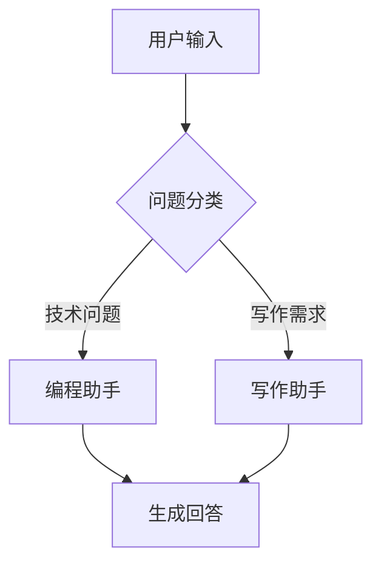

# 🍒 Cherry Studio 桌面端使用方法完全指南

> 基于 GitHub 项目页面内容整理
> 项目地址：https://github.com/CherryHQ/cherry-studio
> 官网：cherry-ai.com

---

## 一、项目概述

### 1.1 基本信息

| 项目            | 内容                                                                           |
| --------------- | ------------------------------------------------------------------------------ |
| **全称**        | Cherry Studio - AI 生产力工作室                                                |
| **定位**        | 支持多个 LLM 提供商的桌面客户端                                                |
| **口号**        | AI productivity studio with smart chat, autonomous agents, and 300+ assistants |
| **支持平台**    | Windows、Mac、Linux                                                            |
| **开源协议**    | AGPL-3.0                                                                       |
| **GitHub 星标** | 39.8k ⭐                                                                        |
| **Fork 数量**   | 3.7k                                                                           |
| **最新版本**    | v1.7.19 (2026年2月14日)                                                        |
| **贡献者**      | 338 人                                                                         |
| **代码提交**    | 5,480+ 次                                                                      |
| **主要语言**    | TypeScript 97.6%、JavaScript 1.5%                                              |

### 1.2 项目特点

Cherry Studio 是一个功能强大的开源 AI 桌面客户端，具有以下核心特点：

- **免配置**：无需搭建环境，下载安装后即可直接使用
- **多模型**：支持数十种主流 AI 大语言模型
- **本地化**：支持本地部署，保护隐私安全
- **可扩展**：支持 MCP 协议扩展和主题定制

### 1.3 技术栈

基于项目代码分析，Cherry Studio 使用以下技术栈：

| 层级       | 技术                     |
| ---------- | ------------------------ |
| **框架**   | Electron                 |
| **前端**   | React + TypeScript       |
| **样式**   | Tailwind CSS + HeroUI    |
| **构建**   | electron-vite            |
| **包管理** | pnpm                     |
| **测试**   | Vitest + Playwright      |
| **AI SDK** | Vercel AI SDK、LangChain |

---

## 二、核心功能模块详解

### 2.1 多 LLM 提供商支持 ☁️🔗💻

Cherry Studio 支持丰富多样的 AI 模型接入方式：

#### 2.1.1 云服务提供商

| 提供商               | 支持的模型                                   | 配置要点                      |
| -------------------- | -------------------------------------------- | ----------------------------- |
| **OpenAI**           | GPT-4o、GPT-4o mini、GPT-5 系列、o1、o3-mini | 需要 OpenAI API Key           |
| **Google Gemini**    | Gemini 2.0 Flash、Pro、Ultra                 | 需要 Google AI Studio API Key |
| **Anthropic Claude** | Claude 3.5 Sonnet、Claude 3 Opus             | 需要 Anthropic API Key        |
| **DeepSeek**         | DeepSeek-V3、DeepSeek-R1                     | 需要 DeepSeek API Key         |
| **通义千问**         | Qwen 系列                                    | 需要阿里云 API Key            |
| **智谱 AI**          | GLM-4、GLM-4V                                | 需要智谱 API Key              |

#### 2.1.2 Web AI 服务

| 服务           | 访问方式   | 说明                |
| -------------- | ---------- | ------------------- |
| **Claude**     | 官方网页版 | 通过 Poe 等平台访问 |
| **Perplexity** | 官方网页版 | AI 搜索服务         |
| **Poe**        | poe.com    | 聚合多种 AI 模型    |

#### 2.1.3 本地模型支持

| 工具          | 说明           | 系统要求            |
| ------------- | -------------- | ------------------- |
| **Ollama**    | 本地运行 LLM   | 需要安装 Ollama     |
| **LM Studio** | 本地模型管理   | 需要安装 LM Studio  |
| **OpenVINO**  | 英特尔优化推理 | 支持 Intel GPU 加速 |

**本地模型配置步骤**：

```
1. 下载安装 Ollama (ollama.com)
2. 在终端运行: ollama pull qwen:7b (或其他模型)
3. 启动 Cherry Studio
4. 设置 → 添加提供商 → 选择 Ollama
5. 输入本地地址: http://localhost:11434
6. 保存并选择模型开始对话
```

### 2.2 AI 助手系统 📚🤖💬

#### 2.2.1 300+ 预配置助手分类

Cherry Studio 内置了 300+ 个预配置的 AI 助手，覆盖多种使用场景：

| 类别         | 示例助手                     | 功能描述           |
| ------------ | ---------------------------- | ------------------ |
| **写作助手** | 文章润色、翻译官、文案生成   | 辅助各类文本创作   |
| **编程助手** | 代码审查、Bug 分析、技术文档 | 代码开发和调试辅助 |
| **学习助手** | 论文精读、知识问答、学习规划 | 知识理解和记忆辅助 |
| **生活助手** | 旅行规划、美食推荐、健康管理 | 日常生活问题处理   |
| **创意助手** | 故事创作、绘画提示、头脑风暴 | 创意内容生成       |
| **分析助手** | 数据分析、报告生成、趋势预测 | 商业和数据分析     |

#### 2.2.2 自定义助手创建

创建专属助手的步骤：

1. 点击左侧边栏 **"+"** 按钮
2. 选择 **"创建助手"**
3. 填写助手信息：
   - 名称：助手显示名称
   - 描述：助手功能简介
   - 角色设定：System Prompt 角色定义
   - 头像：选择或上传图片
4. 添加预设提示词模板
5. 选择默认使用的模型
6. 保存助手

**提示词模板示例**：

```
你是一位专业的技术文档写作者。请用简洁清晰的语言撰写技术文档，确保：
1. 结构清晰，层次分明
2. 术语准确，解释充分
3. 示例丰富，便于理解
4. 格式统一，美观易读
```

#### 2.2.3 多模型同时对话

多模型对话是 Cherry Studio 的特色功能：

- **功能说明**：可以同时向多个 AI 模型发送相同问题，对比不同模型的回答
- **使用场景**：模型选型对比、回答质量评估、多角度分析
- **操作方式**：
  1. 选中多个模型（按住 Ctrl/Cmd 多选）
  2. 输入问题后点击发送
  3. 各模型回答会分别显示
  4. 可以横向对比各模型的回答质量

### 2.3 文档与数据处理 📄☁️📊💻

#### 2.3.1 支持的文件格式

| 类别     | 格式                    | 处理方式            |
| -------- | ----------------------- | ------------------- |
| **文本** | .txt, .md, .json, .xml  | 直接读取内容        |
| **文档** | .docx, .pdf             | 提取文本内容        |
| **表格** | .xlsx, .csv             | 解析数据内容        |
| **图片** | .jpg, .png, .gif, .webp | 视觉理解分析        |
| **代码** | 所有编程语言            | 语法高亮 + 理解分析 |
| **音频** | .mp3, .wav              | 语音转文字 (需 ASR) |

#### 2.3.2 文档处理功能

1. **文件上传**
   - 拖拽上传：直接将文件拖入对话窗口
   - 按钮上传：点击输入框旁的回形针图标
   - 支持多文件同时上传

2. **内容提取**
   - PDF：提取文字和图片
   - Office：解析 Word/Excel 内容
   - 图片：OCR 文字识别 + 视觉理解

3. **对话引用**
   - AI 回答时可以引用文档具体段落
   - 支持追溯原文位置

#### 2.3.3 Mermaid 图表支持

Cherry Studio 原生支持 Mermaid 语法，可绘制：

| 类型   | 用途               |
| ------ | ------------------ |
| 流程图 | 业务流程、系统架构 |
| 时序图 | 交互流程、时间序列 |
| 类图   | 程序结构、数据模型 |
| 状态图 | 状态转换逻辑       |
| 甘特图 | 项目进度管理       |
| ER 图  | 数据库设计         |

**示例**：

````markdown

````

### 2.4 实用工具集成 🔍📝🔤🎯🔌⚙️

#### 2.4.1 全局搜索功能

- **快捷键**：Ctrl/Cmd + K
- **搜索范围**：
  - 对话历史记录
  - 助手名称和描述
  - 设置选项
  - 知识库内容
- **功能特点**：
  - 支持模糊匹配
  - 搜索结果实时显示
  - 一键跳转到目标位置

#### 2.4.2 话题管理系统

- **话题创建**：自动根据对话内容创建话题
- **话题分类**：支持自定义分类和标签
- **话题搜索**：快速定位历史对话
- **话题导出**：支持导出为 Markdown/PDF

#### 2.4.3 AI 翻译功能

- **支持语言**：20+ 种语言互译
- **翻译模式**：
  - 全文翻译
  - 划词翻译
  - 对话翻译
- **特色功能**：
  - 保留原文格式
  - 术语一致性
  - 文化适配

#### 2.4.4 MCP 服务器支持

MCP (Model Context Protocol) 是 Cherry Studio 的核心扩展能力：

**内置 MCP 工具**：

| 工具     | 功能                 |
| -------- | -------------------- |
| 文件系统 | 读取、写入、搜索文件 |
| 数据库   | SQLite 数据库操作    |
| Web 搜索 | 实时网络信息获取     |
| Git 操作 | 代码版本控制         |

**配置 MCP 服务器**：

1. 打开设置 → MCP 服务器
2. 点击添加服务器
3. 输入服务器配置：
   - 服务器名称
   - 服务器地址
   - 认证信息
4. 启用需要的功能
5. 在对话中使用 @工具名 调用

#### 2.4.5 拖拽排序

- 对话列表拖拽重排序
- 助手卡片拖拽整理
- 文件上传顺序调整

### 2.5 用户体验增强 🖥️📦🎨📝🤲

#### 2.5.1 跨平台支持

| 平台    | 安装包格式              | 系统要求      |
| ------- | ----------------------- | ------------- |
| Windows | .exe / .msi / .zip      | Windows 10+   |
| macOS   | .dmg / .app             | macOS 10.15+  |
| Linux   | .AppImage / .deb / .rpm | Ubuntu 18.04+ |

#### 2.5.2 主题系统

**内置主题**：

- 浅色模式 (Light)
- 深色模式 (Dark)
- 跟随系统 (System)

**自定义主题安装**：

1. 访问主题库：cherrycss.com
2. 下载主题文件 (.cherrycss)
3. 打开设置 → 主题 → 导入主题
4. 选择下载的主题文件
5. 应用主题

**社区主题推荐**：

| 主题            | 特点                  |
| --------------- | --------------------- |
| Aero            | 毛玻璃效果，现代化 UI |
| PaperMaterial   | Material Design 风格  |
| Claude 动态风格 | 仿 Claude 网页设计    |
| Maple Neon      | 霓虹灯效果，赛博朋克  |

#### 2.5.3 窗口功能

- **透明窗口**：支持调整窗口透明度
- **置顶模式**：窗口置顶显示
- **多窗口**：支持多个独立窗口
- **迷你模式**：最小化到系统托盘

#### 2.5.4 Markdown 支持

完整支持 Markdown 语法渲染：

- 标题、列表、引用
- 代码块（语法高亮）
- 表格
- 任务列表
- 脚注
- 数学公式 (LaTeX)

#### 2.5.5 内容分享

- 生成分享链接
- 导出为图片/PDF/Markdown
- 一键复制到剪贴板

---

## 三、下载与安装详解

### 3.1 获取安装包

#### 方式一：GitHub Releases（推荐）

1. 打开：https://github.com/CherryHQ/cherry-studio/releases
2. 找到最新版本（Latest）
3. 根据系统选择：

| 系统    | 推荐格式                                 |
| ------- | ---------------------------------------- |
| Windows | .exe (Installer) 或 .msi                 |
| macOS   | .dmg (Apple Silicon) 或 .dmg (Intel)     |
| Linux   | .AppImage (通用) 或 .deb (Debian/Ubuntu) |

#### 方式二：官网下载

1. 访问：cherry-ai.com
2. 点击下载按钮
3. 选择对应平台版本
4. 自动下载安装包

#### 方式三：包管理器（Linux）

```bash
# Debian/Ubuntu
sudo dpkg -i cherry-studio_*.deb

# 或使用 AppImage
chmod +x cherry-studio_*.AppImage
./cherry-studio_*.AppImage
```

### 3.2 首次启动配置

1. **启动应用**：双击图标打开 Cherry Studio
2. **语言选择**：选择界面语言（支持 20+ 语言）
3. **添加 LLM**：配置第一个 AI 模型（详见下文）
4. **开始使用**：选择助手或创建对话

---

## 四、LLM 配置详细指南

### 4.1 OpenAI 配置

**前置条件**：OpenAI API Key

**获取 API Key**：
1. 访问：platform.openai.com
2. 注册/登录账户
3. 进入 API Keys 页面
4. 创建新的 Secret Key

**配置步骤**：
1. 打开 Cherry Studio 设置
2. 选择 "模型设置" → "添加提供商"
3. 选择 "OpenAI"
4. 填写配置：
   - 名称：OpenAI（自定义）
   - Base URL：https://api.openai.com/v1（默认）
   - API Key：粘贴你的 Secret Key
5. 选择模型：gpt-4o、gpt-4o-mini、o1 等
6. 保存设置

### 4.2 Claude 配置

**前置条件**：Anthropic API Key

**获取 API Key**：
1. 访问：console.anthropic.com
2. 创建账户并验证
3. 进入 API Keys 页面
4. 创建新的 API Key

**配置步骤**：
1. 添加提供商 → 选择 "Anthropic Claude"
2. Base URL：https://api.anthropic.com（默认）
3. API Key：粘贴 Anthropic API Key
4. 选择模型：claude-sonnet-4-20250514 等
5. 保存

### 4.3 Gemini 配置

**前置条件**：Google AI Studio API Key

**获取 API Key**：
1. 访问：aistudio.google.com
2. 登录 Google 账户
3. 获取 API Key

**配置步骤**：
1. 添加提供商 → 选择 "Google Gemini"
2. Base URL：https://generativelanguage.googleapis.com/v1beta（默认）
3. API Key：粘贴 Google API Key
4. 选择模型：gemini-2.0-flash、gemini-pro 等

### 4.4 Ollama 本地配置

**前置条件**：已安装并运行 Ollama

**安装 Ollama**：
```bash
# macOS/Linux
curl -fsSL https://ollama.com/install.sh | sh

# Windows
# 访问 ollama.com 下载安装包
```

**下载模型**：
```bash
# 查看可用模型
ollama list

# 下载模型
ollama pull qwen:7b
ollama pull llama3
ollama pull mistral
```

**配置 Cherry Studio**：
1. 添加提供商 → 选择 "Ollama"
2. Base URL：http://localhost:11434
3. 无需 API Key
4. 选择已下载的模型

### 4.5 API 代理配置

如遇网络问题，可配置代理：

1. 设置 → 网络
2. 启用代理
3. 选择代理类型：HTTP / HTTPS / SOCKS5
4. 填写代理地址和端口
5. 测试连接

---

## 五、特色功能深入使用

### 5.1 MCP 服务器高级使用

#### 5.1.1 内置 MCP 工具

**文件系统工具**：

```
@filesystem
- 读取文件：read_file(path)
- 写入文件：write_file(path, content)
- 搜索文件：search_files(directory, pattern)
- 列出目录：list_directory(path)
```

**数据库工具**：

```
@database
- 执行查询：query(sql)
- 获取表信息：get_tables()
- 获取表结构：describe_table(name)
```

#### 5.1.2 第三方 MCP 服务

社区提供了丰富的 MCP 服务：

| 服务       | 功能          | 地址                |
| ---------- | ------------- | ------------------- |
| GitHub MCP | 代码仓库操作  | 需配置 GitHub Token |
| Notion MCP | Notion 集成   | 需 Notion 集成      |
| Slack MCP  | 消息通知      | 需 Slack Bot Token  |
| 飞书 MCP   | 飞书消息/文档 | 需企业应用配置      |

### 5.2 WebDAV 同步配置

#### 5.2.1 支持的服务

| 服务      | 说明            |
| --------- | --------------- |
| Nextcloud | 自建云盘        |
| 坚果云    | 国内云盘服务    |
| 阿里云盘  | 阿里云盘 WebDAV |
| 群晖 NAS  | 本地 NAS 同步   |

#### 5.2.2 配置步骤

1. 打开设置 → 同步与备份
2. 启用 WebDAV 同步
3. 填写配置：
   - 服务器地址：WebDAV URL
   - 用户名：账户名
   - 密码：应用密码
   - 同步文件夹：选择本地同步目录
4. 测试连接
5. 开启自动同步

### 5.3 企业版功能（如适用）

如需团队协作使用，可考虑企业版：

| 功能         | 社区版 | 企业版 |
| ------------ | ------ | ------ |
| 团队知识库   | ❌      | ✅      |
| 统一模型管理 | ❌      | ✅      |
| 员工账户管理 | ❌      | ✅      |
| 角色权限控制 | ❌      | ✅      |
| 数据分析报表 | ❌      | ✅      |
| 私有化部署   | ❌      | ✅      |
| 专业技术支持 | ❌      | ✅      |

---

## 六、快捷键大全

### 6.1 通用快捷键

| 功能       | Windows    | macOS     |
| ---------- | ---------- | --------- |
| 打开设置   | Ctrl + ,   | Cmd + ,   |
| 全局搜索   | Ctrl + K   | Cmd + K   |
| 新建对话   | Ctrl + N   | Cmd + N   |
| 关闭标签页 | Ctrl + W   | Cmd + W   |
| 切换标签页 | Ctrl + Tab | Cmd + Tab |

### 6.2 对话相关

| 功能     | Windows       | macOS         |
| -------- | ------------- | ------------- |
| 发送消息 | Enter         | Enter         |
| 换行     | Shift + Enter | Shift + Enter |
| 停止生成 | Ctrl + C      | Cmd + C       |
| 复制回答 | Ctrl + C      | Cmd + C       |
| 重新生成 | Ctrl + R      | Cmd + R       |

### 6.3 窗口操作

| 功能     | Windows  | macOS          |
| -------- | -------- | -------------- |
| 置顶窗口 | Ctrl + T | Cmd + T        |
| 迷你模式 | Ctrl + M | Cmd + M        |
| 全屏模式 | F11      | Cmd + Ctrl + F |

---

## 七、进阶使用技巧

### 7.1 提示词优化

**结构化提示词**：

```
# 角色
你是一位专业的[领域]专家

# 背景
[描述背景信息]

# 任务
请帮我完成以下任务：
1. [任务1]
2. [任务2]

# 要求
- 格式要求：[具体要求]
- 风格要求：[风格偏好]
- 长度要求：[长度限制]

# 输出格式
[期望的输出格式]
```

### 7.2 模型选择建议

| 场景     | 推荐模型                     |
| -------- | ---------------------------- |
| 日常对话 | GPT-4o mini / Claude 3 Haiku |
| 编程开发 | GPT-4o / Claude 3.5 Sonnet   |
| 长文写作 | Claude 3 Opus / GPT-4o       |
| 数学推理 | OpenAI o1 / DeepSeek-R1      |
| 本地部署 | Qwen 7B / Llama 3            |

### 7.3 多模型对比技巧

1. 准备相同问题
2. 同时选择 2-4 个模型
3. 关注维度：
   - 回答准确性
   - 响应速度
   - 成本效率
   - 格式规范性

---

## 八、学习资源汇总

### 8.1 官方资源

| 资源   | 地址                                     | 说明     |
| ------ | ---------------------------------------- | -------- |
| 官网   | cherry-ai.com                            | 产品首页 |
| 文档   | docs.cherry-ai.com                       | 详细文档 |
| GitHub | github.com/CherryHQ/cherry-studio        | 项目源码 |
| Issues | github.com/CherryHQ/cherry-studio/issues | 问题反馈 |

### 8.2 社区支持

| 平台     | 地址                  | 用途           |
| -------- | --------------------- | -------------- |
| Telegram | t.me/CherryStudioAI   | 交流群         |
| Discord  | discord.gg/wez8HtpxqQ | Discord 服务器 |
| QQ 群    | 575014769             | 中文用户群     |

### 8.3 开发资源

| 资源     | 地址                              |
| -------- | --------------------------------- |
| 开发指南 | docs/guides/development.md        |
| 贡献指南 | CONTRIBUTING.md                   |
| 分支策略 | docs/guides/branching-strategy.md |

---

## 九、版本对比详解

### 9.1 社区版 vs 企业版

| 特性         | 社区版      | 企业版      |
| ------------ | ----------- | ----------- |
| **开源**     | ✅ 完整开源  | ⚠️ 部分开源  |
| **许可证**   | AGPL-3.0    | 商业授权    |
| **使用成本** | 免费        | 订阅/买断   |
| **部署方式** | 本地安装    | 私有云/本地 |
| **模型管理** | 自行配置    | 统一管理    |
| **知识库**   | 个人本地    | 团队共享    |
| **访问控制** | 无          | RBAC 权限   |
| **审计日志** | 无          | 完整记录    |
| **技术支持** | 社区支持    | 专属客服    |
| **更新频率** | GitHub 发布 | 企业专线    |

### 9.2 版本选择建议

| 用户类型         | 推荐版本        |
| ---------------- | --------------- |
| 个人用户         | 社区版          |
| 小团队 (<10人)   | 社区版 + WebDAV |
| 中大型企业       | 企业版          |
| 对数据敏感的组织 | 企业版私有部署  |

---

## 十、常见问题解答

### 10.1 基础问题

**Q1: Cherry Studio 是免费的吗？**
> 社区版完全免费，可以免费使用所有基础功能。企业版需付费订阅。

**Q2: 需要 API Key 吗？**
> 使用云服务（OpenAI、Claude 等）需要对应平台的 API Key。使用本地模型（Ollama）不需要 API Key。

**Q3: 支持哪些操作系统？**
> 支持 Windows、macOS、Linux 三大主流平台。

**Q4: 数据存储在哪里？**
> 社区版数据存储在本地计算机。企业版支持私有化部署，数据完全自主可控。

### 10.2 技术问题

**Q5: API 调用失败怎么办？**
> 1. 检查 API Key 是否正确
> 2. 确认网络连接
> 3. 尝试配置代理
> 4. 查看是否达到 API 限额

**Q6: 本地模型运行缓慢？**
> 1. 确保有足够显存（推荐 8GB+）
> 2. 使用量化模型（如 qwen:7b-q4_K_M）
> 3. 关闭其他占用资源的程序

**Q7: 如何导入自定义主题？**
> 1. 下载 .cherrycss 主题文件
> 2. 设置 → 主题 → 导入主题
> 3. 选择文件并应用

### 10.3 进阶问题

**Q8: 可以同时使用多个模型吗？**
> 可以，使用多模型对话功能可以同时向多个模型发送问题并对比回答。

**Q9: MCP 服务器是什么？**
> MCP（Model Context Protocol）是一种扩展 AI 能力的协议，可以连接外部工具和服务，如文件系统、数据库、Git 等。

**Q10: 如何实现多设备同步？**
> 使用 WebDAV 同步功能，配置坚果云、Nextcloud 等服务即可实现多设备数据同步。

---

## 十一、快速上手路线图

### 阶段一：入门（1-2小时）

```
第1步：下载安装
  ↓
第2步：添加第一个 LLM（推荐 Ollama）
  ↓
第3步：选择预置助手开始对话
  ↓
第4步：体验基本对话功能
```

### 阶段二：进阶（1-2天）

```
第1步：配置更多 LLM 提供商
  ↓
第2步：创建自定义助手
  ↓
第3步：尝试文件上传和分析
  ↓
第4步：体验 MCP 功能
```

### 阶段三：高级（持续探索）

```
第1步：配置 WebDAV 同步
  ↓
第2步：探索社区主题
  ↓
第3步：参与社区讨论
  ↓
第4步：贡献代码（可选）
```

---

## 十二、附录

### 12.1 术语表

| 术语          | 说明                              |
| ------------- | --------------------------------- |
| LLM           | 大语言模型 (Large Language Model) |
| API           | 应用程序接口                      |
| API Key       | 访问 API 的密钥                   |
| MCP           | 模型上下文协议                    |
| WebDAV        | Web 分布式创作和版本控制          |
| System Prompt | 系统提示词                        |
| Token         | 文本处理基本单位                  |

### 12.2 相关项目

| 项目      | 说明                 |
| --------- | -------------------- |
| new-api   | 新一代 LLM 网关      |
| one-api   | LLM API 管理分发系统 |
| Ollama    | 本地大模型运行工具   |
| LM Studio | 本地模型管理工具     |

---

*整理时间：2026年2月14日*
*参考资料：GitHub CherryHQ/cherry-studio*
